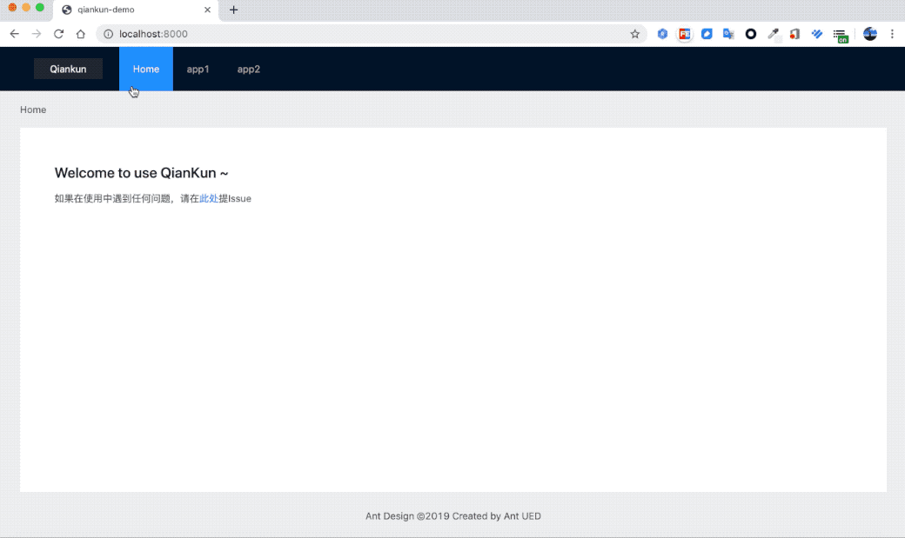

# Umi@2 plugin for [qiankun@v1](https://github.com/umijs/qiankun).

# Umi@3 相应的 qiankun 插件请移步[这里](https://github.com/umijs/plugins/tree/master/packages/plugin-qiankun)

[](https://npmjs.org/package/@umijs/plugin-qiankun) [](https://travis-ci.org/umijs/umi-plugin-qiankun) [](https://npmjs.org/package/@umijs/plugin-qiankun)

## Installation

```shell
$ npm i @umijs/plugin-qiankun@umi2 -S
```

or

```shell
$ yarn add @umijs/plugin-qiankun@umi2
```

## Examples

导航是主应用，App1 和 App2 是子应用，



```bash
$ yarn
$ yarn build
$ yarn start
```

## Features

- ✔︎ 基于 qiankun
- ✔︎ 支持主应用和子应用都用 umi
- ✔︎ 支持主子应用 browser、hash 等多种 history 模式
- ✔︎ 父子应用通讯
- ✔︎ 子应用运行时配置自定义 `bootstrap()`、`mount()` 和 `unmount()`
- ✔︎ 主应用、子应用联调

## Usage

### 主应用

#### 第一步：配置插件

```js
export default {
  plugins: [
    [
      '@umijs/plugin-qiankun',
      {
        master: { ...masterOptions },
      },
    ],
  ],
};
```

[masterOptions 配置列表](#masterOptions)

#### 第二步：配置子应用

子应用的配置方式（二选一）：

##### 构建期配置子应用

```js
export default {
  plugins: [
    [
      '@umijs/plugin-qiankun',
      {
        master: {
          // 注册子应用信息
          apps: [
            {
              name: 'app1', // 唯一 id
              entry: '//localhost:7001', // html entry
              base: '/app1', // app1 的路由前缀，通过这个前缀判断是否要启动该应用，通常跟子应用的 base 保持一致
              history: 'browser', // 子应用的 history 配置，默认为当前主应用 history 配置
            },
            {
              name: 'app2',
              entry: {
                // TODO 支持 config entry
                scripts: [],
                styles: [],
              },
              base: '/app2',
            },
          ],
          jsSandbox: true, // 是否启用 js 沙箱，默认为 false
          prefetch: true, // 是否启用 prefetch 特性，默认为 true
        },
      },
    ],
  ],
};
```

_注意: 当主应用跟子应用的 history 模式一致时（比如都是 browser 或 hash），插件会自动创建一些空路由来避免 404，所以建议主应用跟子应用使用相同的 history mode，否则需要自己处理这些情况。_

##### 运行时动态配置子应用（src/app.js 里开启）

```js
// 从接口中获取子应用配置，export 出的 qiankun 变量是一个 promise
export const qiankun = fetch('/config').then(({ apps }}) => ({
  // 注册子应用信息
  apps,
  jsSandbox: true, // 是否启用 js 沙箱，默认为 false
  prefetch: true, // 是否启用 prefetch 特性，默认为 true
  lifeCycles: {
    // see https://github.com/umijs/qiankun#registermicroapps
    afterMount: props => {
      console.log(props);
    },
  },
  // ...even more options qiankun start() supported, see https://github.com/umijs/qiankun#start
}));
```

由于 umi 不支持在应用 render 之后修改路由，故运行时配置方式插件无法自动生成子应用相关路由，（见[代码](https://github.com/umijs/umi-plugin-qiankun/blob/master/src/master/index.ts#L34)）。所以这里需要用户手动添加子应用相关路由配置避免 404 情况：

###### 1. 主应用新建 pages/subAppContainer.js

```js
import React from 'react';

export default function() {
  return <div />;
}
```

###### 2. 新建 pages/subAppContainer.js

```js
// 主应用 config.js 中添加子应用相关路由配置
export default {
  routes: [
    { path: '/app1', exact: true, component: 'subAppContainer' },
    { path: '/app2', exact: true, component: 'subAppContainer' },
  ],
};
```

### 子应用

安装 `@umijs/plugin-qiankun` ，并在 `.umirc.js/config` 的 plugin 中配置 `@umijs/plugin-qiankun`

#### 第一步：构建层配置

`@umijs/plugin-qiankun` 子应用配置方式有以下两种(选取一种配置即可)： [slaveOptions 配置列表](#slaveOptions)

- 子应用配置

```js
export default {
  base: `/${appName}`, // 子应用的 base，默认为 package.json 中的 name 字段
  plugins: ['@umijs/plugin-qiankun', { slave: { ...slaveOptions } }],
};
```

- 如果子应用配置项为空，即 slave: {}，则可以省略配置：

```js
export default {
  base: `/${appName}`, // 子应用的 base，默认为 package.json 中的 name 字段
  plugins: ['@umijs/plugin-qiankun'],
};
```

#### 第二步：运行时配置（可选）

在子应用的 `src/app.js` 里输出 `qiankun`，`props` 由主应用注册子应用时提供

```js
export const qiankun = {
  // 应用加载之前
  async bootstrap(props) {
    console.log('app1 bootstrap', props);
  },
  // 应用 render 之前触发
  async mount(props) {
    console.log('app1 mount', props);
  },
  // 应用卸载之后触发
  async unmount(props) {
    console.log('app1 unmount', props);
  },
};
```

#### 环境变量配置

为了获得更好地本地开发及调试体验，我们建议您提前在子应用中指定应用启动的具体端口号，如通过`.env`指定

```yml
PORT=8081
```

详细配置参考：https://umijs.org/zh/guide/env-variables.html#port

## 父子应用通讯

有两种方式可以实现

### 基于 props 传递

类似 react 中组件间通信的方案

1. 主应用中配置 apps 时以 props 将数据传递下去（参考主应用运行时配置一节）

   ```js
   // src/app.js

   export const qiankun = fetch('/config').then(config => {
     return {
       apps: [
         {
           name: 'app1',
           entry: '//localhost:2222',
           base: '/app1',
           props: {
             onClick: event => console.log(event),
             ...config,
           },
         },
       ],
     };
   });
   ```

2. 子应用在生命周期钩子中获取 props 消费数据（参考子应用运行时配置一节）

### 基于 Hooks 共享数据

由于方案基于 react hook，所以只能在 functional component 中使用相关 api，无法在 class component 中使用。

1. 约定父应用中在 `src/rootExports.js` 里 export 内容。参考 [rootExports](https://github.com/umijs/umi-plugin-qiankun/blob/master/examples/master/rootExports.js)
2. 子应用中通过 `import { useRootExports } from 'umi'; const rootExports = useRootExports();` 取到。参考 [useRootExports](https ://github.com/umijs/umi-plugin-qiankun/blob/master/examples/app1/pages/index.js#L1)

## API

### <a name="masterOptions">MasterOptions</a>

[qiankun start](https://github.com/umijs/qiankun/blob/master/src/interfaces.ts#L31) 方法其他可接收的参数在这里也都可以配置

| 配置 | 说明 | 类型 | 是否必填 | 默认值 |
| --- | --- | --- | --- | --- |
| apps | 子应用配置, 具体项见下表 | [App](#app)[] | 是 |  |
| jsSandbox | 是否启用 js 沙箱 | boolean | 否 | false |
| prefetch | 是否启用 prefetch 特性 | boolean | 否 | true |
| defer | 是否异步渲染，比如子应用的渲染容器依赖主应用生成的节点，而主应用生成该节点的过程是异步的。<br />当该配置开启的时候，需要使用 `import { qiankunStart } from 'umi'` api 通知 qiankun 启动。参考 [example](https://github.com/umijs/umi-plugin-qiankun/blob/master/examples/master/models/base.js#L35) | boolean | 否 | false |
| fetch | 用于拦截 htmlEntry 静态资源 fetch 时的请求 | function | 否 | fetch |

#### <a name="app">App</a>

| 配置 | 说明 | 类型 | 是否必填 | 默认值 |
| --- | --- | --- | --- | --- |
| name | 子应用唯一 id | string | 是 |  |
| entry | 子应用 html 地址 | string \| { script: string[], styles: [] } | 是 |  |
| base | 子应用路由前缀，通常跟子应用的 [base 配置](https://umijs.org/config/#base) 一致，框架会以这个配置作为前缀判断是否激活当前应用，支持配置一组前缀 | string \| string[] | 是 |  |
| history | [umi history mode](https://umijs.org/config/#history) | string | 否 | 主应用 history 配置 |
| mountElementId | 子应用挂载到主应用的哪个 id 节点上（注意不要跟子应用的 mountElementId 一致） | string | 否 | root-subapp |
| props | 主应用传递给子应用的数据 | object | 否 | {} |

### <a name="slaveOptions">SlaveOptions</a>

| 配置 | 说明 | 类型 | 是否必填 | 默认值 |
| --- | --- | --- | --- | --- |
| keepOriginalRoutes | 子应用通过设置此配置，在编译时会按照 keepOriginalRoutes 的值添加一份 route 的快照(如果值为 true 将默认取 packageName)，并将快照路由前缀改为/\${keepOriginalRoutes}添加到 routes | boolean \| string | 否 | false |

## Roadmap

- [x] 支持 browserHistory
- [x] master 运行时配置
- [ ] 子应用嵌套
- [ ] 公共依赖加载策略
- [x] 子应用单独调试
- [x] 基于 Hooks 的父子应用通讯（需强制 external React 保证一个 React 实例）

## Questions & Suggestions

Please open an issue [here](https://github.com/umijs/umi/issues?q=is%3Aissue+is%3Aopen+sort%3Aupdated-desc).

## Community

https://github.com/umijs/umi#community

## 相关

- [RFC: 微前端（@umijs/plugin-qiankun） by sorrycc · Pull Request #3 · umijs/rfcs · GitHub](https://github.com/umijs/rfcs/pull/3)

- [umi-example-monorepo](https://github.com/umijs/umi-example-monorepo) 之前尝试的另一种简单粗糙的微前端试验

## LICENSE

MIT
